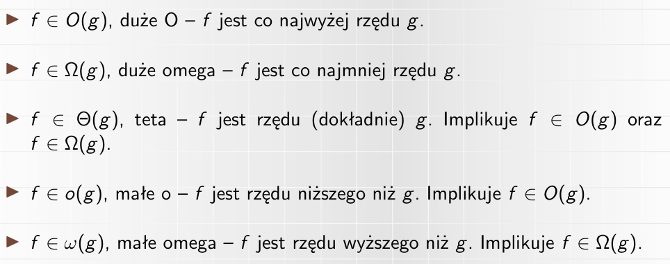
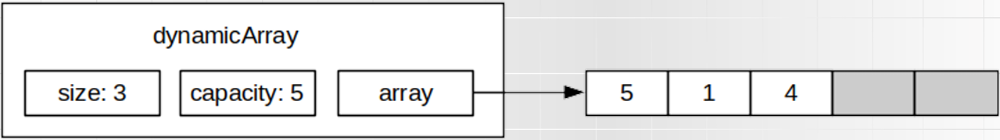
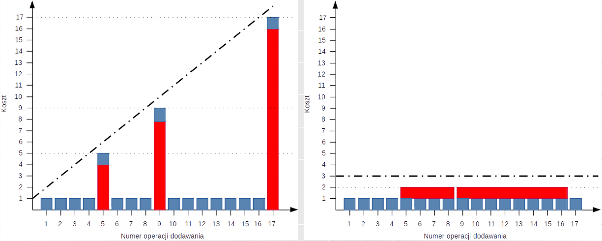
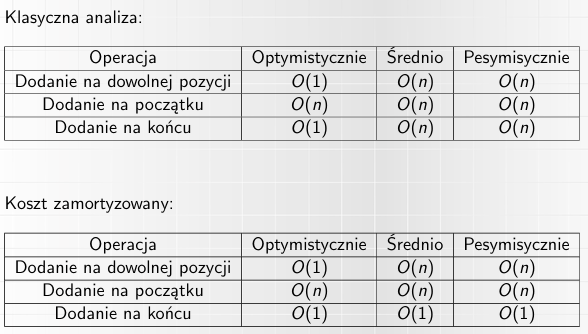
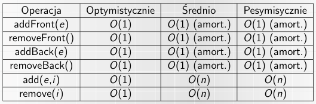
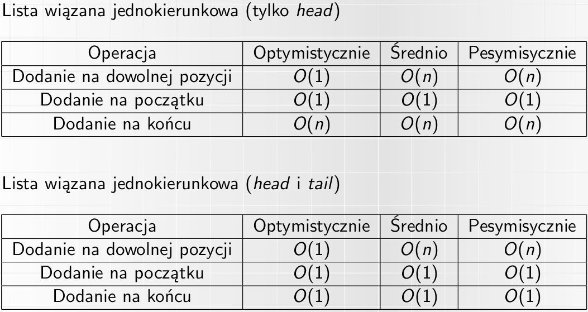
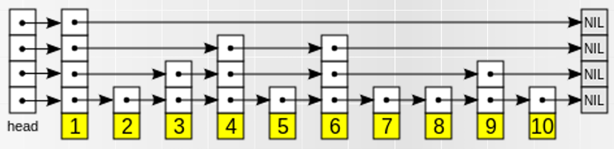
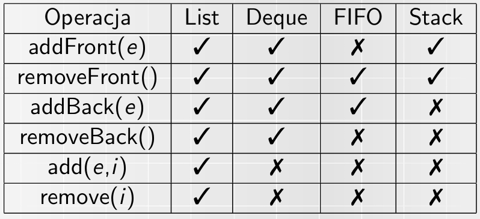
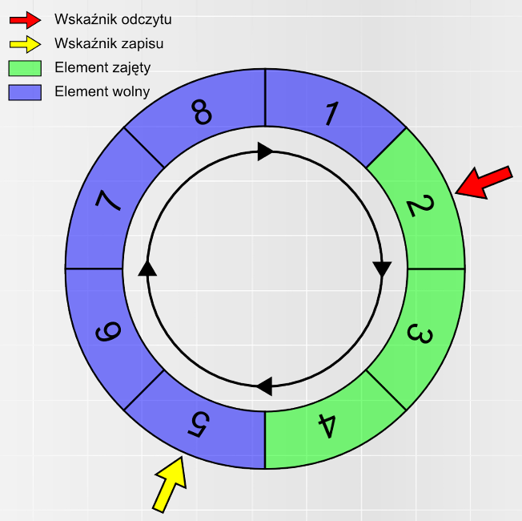

## 0. Wstęp

### ADT a struktura danych

**ADT** (Abstract Data Type) (np. lista) oznacza definicję typu danych tylko za pomocą wartości i operacji na tym typie danych.
**Struktura danych** (np. tablica dynamiczna, lista wiązana) jest konkretną implementacją ADT.

### Złożoność obliczeniowa

Najpopularniejszą notacją jest notacja dużego O - oznacza ona, że złożoność operacji jest **co najwyżej rzędu g** dla O(g). Jeśli nie zostało podane sprecyzowanie, to standardowo mowa jest zawsze o złożoności pesymistycznej.

Często wykorzystywanymi rzędami, przedstawionymi w kolejności rosnącej, są:

- O(1) - złożoność stała
- O(log n) - złożoność logarytmiczna
- O(n) - złożoność liniowa
- O(n^2) - złożoność kwadratowa
- O(n^3) - sześcian
- O(2^n) - złożoność wykładnicza
- O(n!) - silnia

Wszystkie notacje zostały przedstawione na [rysunku](image-7.png).

## 1. Listy jedno i dwukierunkowe, listy samoorganizujące się

**Lista (ADT)** jest kontenerem przechowującym elementy, mogące być różnych typów. Określa ona kolejność elementów, mogą się one powtarzać. Jeden element ma jedną wartość (ale tą wartością może być kolejna lista).

Lista ma zmienną dlugość i zawartość - elementy można dodawać, usuwać i modyfikować. Typowo rozważane operacje na listach to:

- stworzenie pustej listy
- dostęp (zwrócenie) elementu na pozycji _i_
- dodanie elementu _e_ na pozycji _i_, w tym:
- - dodanie elementu _e_ na początek listy
- - dodanie elementu _e_ na koniec listy
- usunięcie elementu _e_ na _i_ pozycji, w tym:
- - usunięcie elementu _e_ na początku listy
- - usunięcie elementu _e_ na końcu listy
- zwrócenie rozmiaru (liczby elementów) listy
- sprawdzenie czy lista jest pusta
- wyszukanie elementu _e_

### Implementacje ADT listy:

#### Tablica dynamiczna

Tablica dynamiczna najczęściej przechowuje:

- **array** - wskaźnik na tablicę utworzoną dynamicznie
- **capacity** - rozmiar tablicy array (w liczbie elementów)
- **size** - liczba przechowywanych elementów

W związku z tym zajmowana pamięć to capacity + 3, czyli O(capacity). W praktyce jako, że capacity < 2n, to pamięć jest rzędu O(n).

Cechą charakterystyczną dla tablicy _dynamicznej_ jest wykorzystanie funkcji _realloc()_ w celu zmianu rozmiaru tablicy - dzieje się to w momencie dodania elementu, jeśli nie ma na niego miejsca (size jest równy capacity). Istnieją dwa głowne podejścia:

- zwiększanie capacity o 1 (capacity = capacity + 1)
- zwiększanie capacity razy 2 (capacity = capacity \* 2)

W drugiej z opcji osiągane są lepsze wyniki pod względem złożoności obliczeniowej, w zamian za gorsze pod względem złożoności pamięciowej.

Tablica przy wykonaniu operacji _realloc()_, może wymagać przeniesienia do nowej lokalizacji (_memcpy()_).

Na [rysunku](image-1.png) widoczne jest porównanie przypadku pesymistycznego vs koszt amortyzowany dla operacji dodawania elementu do tablicy dynamicznej, przy wykorzystaniu zwiększania capacity razy dwa. Koszt amortyzowany uśrednia pesymistyczne przypadki dla kolejnych elementów (w uproszczeniu).

Na [rysnku](image-3.png) znajduje się złożoność operacji dla tablicy dynamicznej. **Ważne**: przedstawione złożoności odnoszą się do wersji z wprowadzonym usprawnieniem w postaci zaalokowania miejsca na "indeksy ujemne" (umożliwienie dodawania elementów na początku tablicy bez potrzeby przesuwania wszystkich elementów o jedno miejsce dalej).

Dodatkowo, **wszystkie z pozostałych wymienionych w ADT listy operacje oprócz wyszukania elementu _e_ odbywają się w czasie stałym (O(1))**. Wyszukanie elementu _e_ po jego wartości zamiast indeksie wymaga w pesymistycznych przypadku przeszukania całej tablicy (O(n)).

#### Lista wiązana (jednokierunkowa)

W liście wiązanej każdy element (węzeł) zawiera:

- właściwą wartość (value)
- wskaźnik na kolejny element listy (next)

Elementy mogą mieć różną lokalizację w pamięci (w przeciwnieństwie do tablicy dynamicznej).

Struktura przechowuje wskaźnik _head_ na pierwszy element. Lista kończy się gdy wskaźnik ma wartość _null_. Oprócz tego przechowywany jest _size_.

Zajmowana pamięć wynosi 2n + 2, czyli O(n).

Możliwym usprawnieniem jest dodanie wskaźnika _tail_, który wskazuje na ostatni element listy (dla listy pustej null). Umożliwia on dodawanie elementu na koniec listy w czasie O(1) zamiast O(n).

Na [rysunku](image-5.png) znajdują się złożoności operacji dodawania dla listy wiązanej.

- stworzenie pustej listy
- dostęp (zwrócenie) elementu na pozycji _i_
- dodanie elementu _e_ na pozycji _i_, w tym:
- - dodanie elementu _e_ na początek listy
- - dodanie elementu _e_ na koniec listy
- usunięcie elementu _e_ na _i_ pozycji, w tym:
- - usunięcie elementu _e_ na początku listy
- - usunięcie elementu _e_ na końcu listy
- zwrócenie rozmiaru (liczby elementów) listy
- sprawdzenie czy lista jest pusta
- wyszukanie elementu _e_

Dodatkowo, stworzenie pustej listy, zwrócenie rozmiaru listy oraz sprawdzenie czy lista jest pusta odbywa się w czasie stałym (O(1)). Dostęp (zwróćenie elementu) zarówno po pozycji oraz po wartości odbywa się w złożoności O(n). Usuwanie elementów odbywa się analogicznie do ich dodawania.

#### Lista dwukierunkowa

Lista dwukierunkowa jest listą wiązaną, w której każdy element (węzeł) ma wskaźnik zarówno do następnego elementu (next), jak i do poprzedniego (prev). Struktura ta przechowuje wskaźniki _head_ i _tail_.

Zajętość pamięci wynosi 3n + 3 - jest to wciąż O(n) nastomiast jest to znacząco więcej niż lista wiązana jednokierunkowa.

Dzięki dodaniu wskaźników prev przemieszczanie się po liście jest ułatwione, a czas dotarcia do węzła _i_ jest dwukrotnie krótszy, natomiast nadal jest to O(i). Różnica ta jest znacząca dla operacji dodawania/usuwania na dowolnej pozycji, szukania oraz przeglądania.

#### Lista cykliczna

W przypadki listy cyklicznej ostatni element wskazuje na pierwszy (zamiast na null). Dla listy dwukierunkowej też pierwszy element wskazuje na ostatni. Wciąż istnieje wskaźnik _head_, ponieważ jest on konieczny do umożliwienia dostania się do listy, natomiast dowolny element jest początkiem/końcem listy.

Lista cykliczna jest wykorzystywana do implentacji niektórych kolejek, buforów cyklicznych oraz kopca Fibonacciego. Jest ona przydatna gdy po liście przechodzimy wielokrotnie.

#### Lista z przeskokiem

Jest to probabilistyczna struktura danych. Lista z przeskokiem stanowi rozszerzenie listy wiązanej o wielokrotne wiązania - wiązania mogą pomijać elementy, co widoczne jest na [rysunku](image-6.png).

#### Samoorganizujące się listy

Istnieje kilka implementacji ADT listy w postaci samoorganizujących się list. Są to takie struktury, gdzie elementy zmieniają kolejność w wyniku kolejnych operacji dostępu/wyszukiwania. Jeśli są one częściej używane, to stają się łatwiej dostępne. Te rozwiązania najlepiej sprawdzają się, gdy 20% elementów jest celem 80% wyszukiwań (Zasada 80-20).

Wśród nich znajdują się:

- **Metoda move-to-front**
- **Metoda transpose (swap)**
- **Metoda count**

## 2. Stosy, kolejki, kolejki cykliczne, kolejki priorytetowe

Kolejka - ADT, w którym dodawanie i usuwanie elementów jest ze sobą powiązane tj. usuwany element, jest określony przez cechy elementó dodanych do tej pory (np. przez ich kolejność, priorytet).

Typowe operacje na kolejkach:

- dodanie elementu
- usunięcie elementu
- sprawdzenie czy kolejka jest pusta (bądź zwrócenie rozmiaru)
- podgląd do usunięcia (peek), ale bez usuwania

Kolejki zasadniczo nie służą do dostępu do dowolnego elementu, wyszukiwania czy przeglądania - aby dostać się do trzeciego elementui, należy najpierw zdjąc element pierwszy i drugi.

### Implementacje ADT kolejki:

#### Kolejka FIFO - Sterta

Kolejka FIFO, zwana także stertą (heap) to standardowy rodzaj kolejki (jeśli nie zostanie podane doprecyzowanie rodzaju). Zasada FIFO (First In First Out) oznacza, że element dodany jako pierwszy jest usuwany jako pierwszy (analogicznie do kolejce do kasy w sklepie).

Operacja dodawania nazywa się **enqueue**, a zdejmowania **dequeue**.

Złożoność obliczeniowa zależy od tego jaką implementacje listy wybierzemy. Dla listy wiązanej jednokierunkowej z tail oraz dla listy dwukierunkowej wszystkie operacje posiadają złożoność O(1) (aczkolwiek odznaczają się większą zajętością miejsca w pamięci). Dla tablicy dynamicznej wszystkie operacje także mają założoność O(1), jeśli pod uwage zostanie wzięty czas amortyzowany.

Dla listy wiązanej jednokierunkowej (bez tail) złożoność jest zależna od tego w jakiej kolejności ustawimy elementu (z której strony następuje enqueue i dequeue) - w obu przypadkach minimum jedna operacja jest w czasie liniowym zamiast stałym.

Kolejka FIFO jest wykorzystywana do m.in. buforów, przechowywania żądań obsługiwanych w kolejności żadąń, modelowania kolejek sklepowych czy przeglądzie wszerz drzewa.

#### Kolejka LIFO - Stos

Kolejka LIFO, zwana także stosem (stack) wykorzystuje zasade LIFO czyli Last In First Out - oznacza to, że element dodany jako ostatni jest usuwany jako pierwszy (analogicznie do stosu talerzy w szufladzie).

Dla kolejki LIFO operacja dodawania nazywa się **push()**, zdejmowania **pop()**, a peek często nazywana jest **top()**.

Złożoność dla każdej ze struktur: tablica dynamiczna, lista wiązana jednokierunkowa (zarówno z samym head oraz head i tail) i tablica dwukierunkowa, wynosi O(1) dla wszystkich operacji (jeśli weźmiemy pod uwagę koszt amortyzowany dla tablicy dynamicznej oraz ustawimy elementy w liście wiązanej jednokierunkowej z samym head, tak że ostatnio dodany element znajduje się na początku).

Kolejka LIFO jest wykorzystywana do m.in. przeglądu w głąb drzewa i algorytmów z nawrotami (backtracking).

#### Kolejka dwukierunkowa

Kolejka dwukierunkowa charakteryzuje się tym, że możliwe jest zarówno dodawanie, jak i usuwanie elementów na obu końcach. Zwana jest ona także deque (double-ended que).

Kolejka LIFO i FIFO mogą być traktowane jako uszczegółowienie (wzięcie pod uwage zaledwie części operacji operacji) deque, a deque może być brane pod uwage jako uszczegółowienie listy, co widoczne jest na [rysunku](image-8.png).

Wszystkie operacje będą miały złożoność stałą dla implementacji z użyciem listy wiązanej jednokierunkowej z tail oraz listy dwukierunkowej, a także tablicy dynamicznej, jeśli weźmiemy pod uwagę koszt amortyzowany. Dla listy wiązanej jednokierunkowej z samym head żłożoność dla części operacji jest liniowa.

#### Kolejka cykliczna

Kolejka (bufor) cykliczny ma zwykle stały rozmiar i działa w charakterze FIFO. Posiada ona dwa wskaźniki - na aktualny początek (odczyt) i koniec (zapis) kolejki, co widoczne jest na [rysunku](image-9.png).

Gdy jeden wskaźnik dogoni drugi, operacja możliwa jest dopiero po przesunięciu drugiego wskaźnika. Stare dane są nadpisywane przez nowe.

Przy dobrej implementacji czas operacji wynosi O(1).

#### Kolejka priorytetowa

Kolejka priorytetowa to taka kolejka, w której każdy element ma przypisany priorytet liczbowy - wszystkie elementy są parą klucz-wartość (gdzie na kluczach da się określić minimum/maksimum).

O kolejności kolejki decyduje priorytet elementów - zdejmowanie elementu zawsze zdejmuje element o największym (bądź najmniejszym) priorytecie.

Może istnieć wiele elementów o tym samym priorytecie. Dla strategii FIFO (stabilnej) mamy gwarancję zdejmowania elementów w kolejności ich dodawania, natomiast można stosować także niestabilną strategię.

Dla kolejki priorytetowej typu max istnieją następujące opracje:

- insert(e,p) - dodanie elementu _e_ o priorytecie _p_
- extract-max() - usunięcie i zwrócenie elementu o największym priorytecie
- find-max() - zwrócenie elementu o największym priorytecie
- modify-key(e,p) - zmiana priorytetu elementu _e_ na _p_ (można podzielić na operacje decrease-key i increase-key)

Jej zaimplementowanie jest możliwe na dwa sposoby

- łatwiejsze dodawanie - elementy dodajemy po kolei (w czasie stałym), dla usuwania oraz podejrzenia należy przeszukać (w pesymistycznym przypadku) całą listę
- łatwiejsze usuwanie - elementy dodajemy w kolejności według priorytetu (w czasie liniowym), natomiast usuwanie oraz podejrzenie odbywać się będzie w czasie stałym

Operacja modyfi-key(e,p) w obu podejściach odbywać się będzie w czasie liniowym.

## 3. Drzewa binarne, kopce

## 4. Tablice z hashowaniem

## 5. Drzewa binarne

## 6. Grafy

## 7. Algorymy wyznaczające najkrótszą i najdłuższą drogę w grafie

## 8. Harmonogramowanie projektó z wykorzystaniem algorytmów grafowych

## 9. Zarządzanie pamięcią

## 10. Tablice z haszowaniem

## 11. Słowniki

## 12. XML - uniwersalny język znaczników, wyszukiwanie i przetwarzanie informacji
