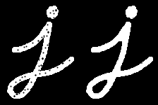
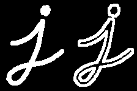

Co to system wizyjny? System wizyjny to układ (współpracujących ze sobą) urządzeń (elektronicznych), którego zadaniem jest analiza wizyjna otoczenia na podobieństwo zmysłu wzroku u ludzi.

# Systemy Wizyjne

**
OBRAZ TO MACIERZ!
**

## Przetwarzanie Obrazów Przemysłowych - Główne Zagadnienia

### Wybór sprzętu

- kamery, obiektywy,
- oświetlenie,
- sprzęt komputerowy,
- połączenie pomiędzy kamerą a komputerem:
    - CameraLink
    - USB
    - Ethernet
    - światłowód
    - WiFi (niezalecane)
- typy kamery:
    - światło widzialne
    - podczerwień
    - pasmo ultrafioletowe
    - promieniowanie rentgenowskie
    - ultrasonograf 
- typy sensorów:
    - CMOS
    - CCD 

### Dodatkowe problemy
- mechaniczny montaż kamer, oświetlenia i pozostałych elementów systemu
- zasilanie
- kompatybilnośc elektromagnetyczna
- metody archiwizacji (tylko defekty czy wszystkie zdjęcia)

### Algorytm
- wybierz algorytm do przetwarzania,
- przetestuj inne algorytmy, jeśli wynik nie jest zadowalający,
- implementacja algorytmu (lub wybór z bibliotek)

> [!Important]
> **PODSUMOWANIE**
> 1. Przetwarzanie obrazów jest najważniejszym, ale nie jedynym elementem zagadnienia,
> 2. Oświetlenie, optyka oraz wybór kamery pozwala ograniczyć trudności w przetwarzaniu,
> 3. Przy kalkulacji kosztów należy spodziewać się niespodziewanego

## Ustawienia kamery

Kamery przemysłowe mają większość parametrów ustawianych ręcznie, często wprost mechanicznie:
- **przysłona** - steruje ilością światła docierającego do matrycy, znajduje się na obiektywie. Jest to stosunek średnicy źrenicy wejściowej do ogniskowej obiektu. By poprawnie ją ustawić należy uwzględnić:
    - głębie ostrości
    - liczbę klatek na sekundę,
    - wzmocnienie przetwornika
- **czas naświetlania** - jak długo każda klatka jest naświetlana (matryca kamery całkuje),
- **liczba klatek na sekundę (framerate)** - ile klatek pobieramy, nie może być wyższa niż $1/t$
- **wzmocnienienie kolorów**

## Etapy przetwarzania
1. akwizycja obrazu,
2. obróbka obrazu (dedykowana problemowi),
3. wykrywanie obiektów,
4. lokalizowanie obiektów,
5. pomiary, porównania lub opisanie,
6. wybór cech, rozpoznawanie, klasyfikacja

> [!Important] 
> 
 Przetwarzanie obrazów przemysłowych   =  
> automatyczna inspekcja wizulana + wykrycie zmian + decyzja

## Główne przyczyny błędów
- złe oświetlenie
- źle dobrana optyka kamery
- źle dobrana matryca
- pomyłki człowieka
- wibracje podłogi
- ruch gorącego powietrza
- kurz, opary
- zbyt wysoka temperatura – szum
- wilgotność – krople rosy na obiektywie

## Podstawowe operacje na obrazie
- obrót
- odbicie lustrzane
- odbicie względem osi (flip)
- negacja (inwersja) obrazu binarnego lub w odcieniach szarości
$$
f'_{ij} = 1 - f_{ij}, \quad f'_{ij} = 255 - f_{ij}
$$

## Operacje na parach obrazów
- dodawanie - filtracja
- odejmowanie - znaleznie różnicy, wycinanie tła, znalezienie ruchu
- kombinacja liniowa
- dzielenie - wykrywanie ruchu, poprawa wycięcia tła
- operacje logiczne
- mnożenie
- wartość bezwględna różnicy
- makismum - wybiera jaśniejsze
- minimum - wybiera ciemniejsze

## Histogram
1. Weź poziomy szarości $f_{ij}$ ignorując położenie
2. Podziel przedział $[0, 255]$ na podprzedziały $[k ∆, (k + 1) ∆)$
3. Policz ile $f_{ij}$ wpada w przedział $[k ∆, (k + 1) ∆)$ – oznacz przez $n_k$
4. Pokaż $n_k$ (lub $n_k/(M · N)$) vs $k$

>[!Tip]
> **Na chłopski rozum:** 
> Bierzesz i dzielisz sobie zakres pikseli na przedziały. Potem liczysz ile jest pikseli w każdym przedziale i pokazujesz to na wykresie słupkowym.

## Progrowanie

### Definicja progowania
Progowanie w przetwarzaniu obrazów przemysłowych to operacja segmentacji, polegająca na przekształceniu obrazu w odcieniach szarości w obraz binarny poprzez porównanie wartości jasności pikseli z ustalonym progiem decyzyjnym, w celu wydzielenia obiektów od tła na podstawie różnic intensywności.

>[!Tip]
> **Na chłopski rozum:** 
> Bierzesz histogram i stawiasz pinową kreche, to co na lewo od kreski jest czarne, to co na prawo białe.

### Metody progowania - wybór progu

- metoda podstawowa lub inaczej metoda prosta
- metoda $k$-średnich (w tym metoda 2-średnich)
- progowanie Bayesowskie
- progowanie metodą Otsu
- maksimum entropii

### Metody wykrywania krawędzi

- przybliżenie gradientu 1-rzędu
- przybliżenie laplasjanu 2-rzędu
- operacje morfologiczne
- splot obrazu z maską:
    - maska Prewitt-a
    - maska Sobela

## Operacje morfologiczne

> [!Note]
> Oprócz operacji wypisanych niżej mamy takie coś jak Top Hat i White Hat, ale raczej nie spotkamy się z tym za często.

Dla erozji i dylatacji użyjemy tego zdjęcia jako "wejścia" do algorytmu:

### Erozja

Podstawowa koncepcja erozji jest taka sama jak w przypadku erozji gleby, polega ona na zacieraniu granic obiektów na pierwszym planie. Wynik po erozji zdjęcia bazowego:

W efekcie wszystkie piksele w pobliżu granicy zostaną odrzucone, w zależności od rozmiaru jądra. W rezultacie grubość lub rozmiar obiektu na pierwszym planie maleje, lub po prostu zmniejsza się biały obszar obrazu. Jest to przydatne do usuwania małych białych szumów (jak widzieliśmy w rozdziale o przestrzeni kolorów), oddzielania dwóch połączonych obiektów itp.

### Dylatacja

To jest dokładnie odwrotne do erozji. W tym przypadku element piksela ma wartość „1”, jeśli co najmniej jeden piksel pod jądrem ma wartość „1”. Zatem zwiększa to biały obszar obrazu lub zwiększa rozmiar obiektu na pierwszym planie. Zazwyczaj, w przypadkach takich jak usuwanie szumu, po erozji następuje dylatacja. Erozja usuwa szum, ale jednocześnie zmniejsza obiekt. Dlatego go rozszerzamy. Ponieważ szum zniknął, nie powrócą, ale obszar obiektu się zwiększy. Jest to również przydatne do łączenia uszkodzonych części obiektu.

Wynik po dylatacji obiektu bazowego:

### Otwarcie

Otwarcie to po prostu inna nazwa erozji, po której następuje dylatacja. Jest to przydatne w usuwaniu szumu, jak to było wspomniane wyżej.

Wynik po otwarciu - zdjęcie po lewej przed, po prawej po:

### Domknięcie lub Zamknięcie

Zamykanie jest odwrotnością otwierania, dylatacji, a następnie erozji. Jest przydatne do zamykania małych otworów wewnątrz obiektów na pierwszym planie lub małych czarnych punktów na obiekcie.

### Gradient morfologiczny

To różnica między rozszerzeniem a erozją obrazu. Rezultat będzie wyglądał jak kontur obiektu.

## Zastosowania Systemów Wizyjnych

Systemy wizyjne można zastosować właściwie wszędzie gdzie cokolwiek widać; w wymagających gałęziach przemysłu, od skali mikro do całych budynków lub miast, w świetle widzialnym, podczerwonym, UV, ultrasonografia, skanery laserowe, obrazy 2D i 3D

### Przemysł Samochodowy
- jakość szyb
- poprawność wykonania filtra spalin
- tarcze sprzęgła
  
### Przemysł Farmaceutyczny
- poprawność napełnienia ampułek
- wykonanie plastrów
- liczba i kolor tabletek

### Przemysł Materiałów Budowlanych
- ocena wypalania cegieł i dachówek
- powierzchnia płytek ceramicznych
- izolatory

### Przemysł Hutniczy
- ocena jakości blach i rur
- jakość walcowania drutu

### Przemysł Spożywczy
- ocena zbiorów
- ocena przecierów dla dzieci
- stan owoców
- nadzór chłodni
  
### Przemysł Elektroniczny
- poprawność trawienia płytek
- poprawność montażu elementów elektronicznych
  
### Pakowanie
- zamykanie butelek z mlekiem
- zakrętki
- kontrola napełniania butelek
- kontrola kompletności zestawów
- zliczanie przy składowaniu
